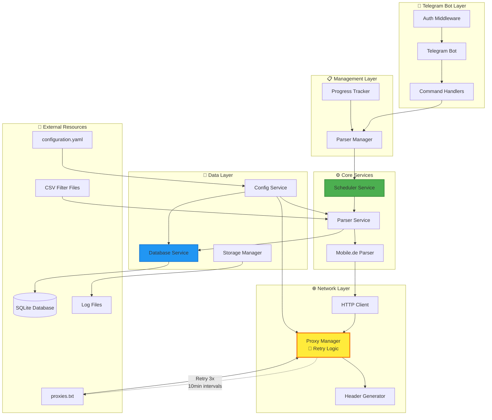
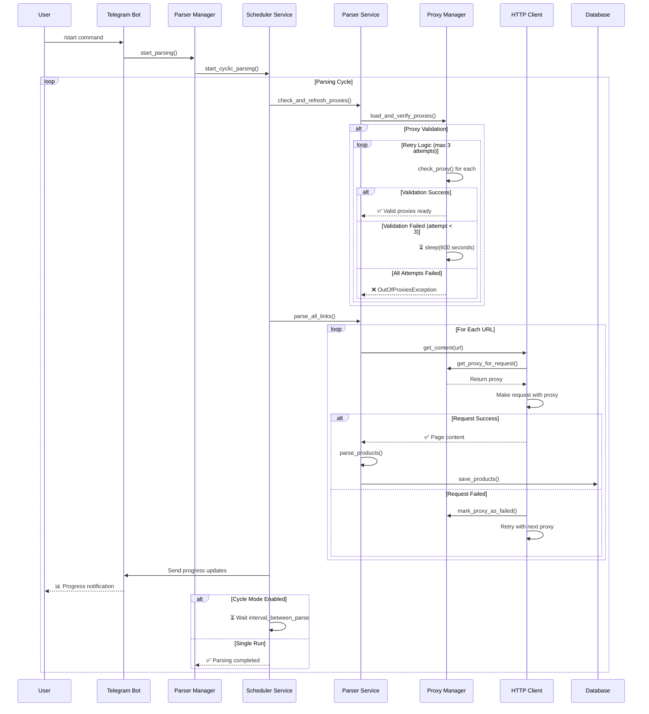

# ТЕХНИЧЕСКИЙ МАНУАЛ ПО ПРОЕКТУ MOBILEDE

## ОБЩЕЕ ОПИСАНИЕ

Проект MobileDe представляет собой автоматизированную систему парсинга автомобильных объявлений с сайта mobile.de. Система состоит из Telegram-бота для управления и веб-парсера для сбора данных.

## ЛОГИКА РАБОТЫ СИСТЕМЫ

### Основной процесс

1. **Инициализация системы:**
   - Загрузка конфигурации из `configuration.yaml`
   - Валидация прокси-серверов с retry механизмом (3 попытки × 10 минут)
   - Инициализация базы данных SQLite
   - Запуск Telegram-бота

2. **Запуск парсинга (команда `/start`):**
   - Планировщик запускает циклический процесс
   - Проверка и обновление прокси перед каждым циклом
   - Параллельная обработка URL-адресов (макс. 5 одновременно)
   - Применение фильтров и правил обработки данных
   - Сохранение в базу данных с автодедупликацией

3. **Управление прокси:**
   - Автоматическая проверка работоспособности
   - Retry логика: 3 попытки с интервалом 10 минут
   - Ротация прокси: случайный для первого запроса, затем по кругу
   - Исключение неработающих прокси из пула

4. **Обработка данных:**
   - Парсинг HTML с помощью BeautifulSoup
   - Применение фильтров (бренды, дилеры, количество изображений)
   - Замена текста по правилам из CSV-файлов
   - Форматирование по шаблонам

### Устойчивость системы

- **Retry механизм для прокси:** предотвращает остановку при временных сбоях
- **Обработка ошибок HTTP:** автоматические повторные попытки
- **Graceful shutdown:** корректное завершение при получении сигналов
- **Детальное логирование:** полная видимость процессов

## СХЕМА ВЗАИМОДЕЙСТВИЯ МОДУЛЕЙ

### Архитектурная диаграмма



### Последовательность выполнения



## АРХИТЕКТУРА СИСТЕМЫ

### Основные компоненты:
- **Telegram Bot** - интерфейс управления парсером
- **Parser Service** - сервис парсинга веб-страниц
- **Database Service** - управление базой данных SQLite
- **HTTP Client** - HTTP-клиент с поддержкой прокси
- **Proxy Manager** - управление прокси-серверами
- **Scheduler Service** - планировщик задач

### Технологический стек:
- Python 3.12+
- aiogram 3.0+ (Telegram Bot API)
- SQLAlchemy 2.0+ (ORM для базы данных)
- aiohttp (асинхронные HTTP-запросы)
- BeautifulSoup4 (парсинг HTML)
- Pydantic (валидация данных)
- Loguru (логирование)

## ФУНКЦИОНАЛЬНОСТЬ

### Команды Telegram-бота:

#### Основные команды:
- `/start` - запуск парсинга
- `/stop` - остановка парсинга
- `/status` - статус парсера
- `/help` - справка по командам

#### Управление данными:
- `/seturl` - установка ссылки для парсинга
- `/dbstats` - статистика базы данных
- `/sqldump` - создание SQL-дампа
- `/exportdb` - экспорт данных в архив
- `/cleardb` - очистка базы данных

### Парсинг данных:
- Автоматический сбор автомобильных объявлений
- Фильтрация по количеству изображений
- Исключение брендов и дилеров
- Замена текста по правилам
- Форматирование данных по шаблонам

## КОНФИГУРАЦИЯ

### Основные параметры (configuration.yaml):

#### Парсер:
- `base_url` - базовый URL сайта
- `pages` - количество страниц для парсинга
- `items_per_page` - товаров на странице
- `timeout` - таймаут запросов (15 сек)
- `retries` - количество повторных попыток HTTP запросов (3)
- `delay_min/max` - задержки между запросами (0.1-0.5 сек)
- `max_concurrency` - максимальная параллельность (5)
- `interval_between_parse` - интервал между циклами (1800 сек)
- **`proxy_check_retries`** - количество попыток валидации прокси (3)
- **`proxy_check_interval`** - интервал между retry попытками (600 сек = 10 мин)
- `proxy_timeout` - таймаут для прокси (5 сек)
- `exclude_ads_pictures` - исключение по количеству изображений (-1 = все)

#### Файлы:
- `brand_excludes_file` - исключаемые бренды
- `dealer_excludes_file` - исключаемые дилеры
- `dealer_exclude_images_file` - правила исключения изображений
- `replaces_file` - правила замены текста
- `db_path` - путь к базе данных

#### Шаблоны:
- `title` - шаблон заголовка товара
- `seo_title` - SEO-заголовок
- `seo_description` - SEO-описание
- `seo_keywords` - ключевые слова

## СТРУКТУРА ПРОЕКТА

```
MobileDe/
├── bot/                    # Telegram-бот
│   ├── handlers/          # Обработчики команд
│   ├── middleware/        # Промежуточное ПО
│   ├── models/           # Модели бота
│   ├── services/         # Сервисы бота
│   └── utils/            # Утилиты
├── core/                  # Основная логика
│   ├── models/           # Модели данных
│   ├── parsers/          # Парсеры
│   └── services/         # Основные сервисы
├── shared/                # Общие компоненты
│   ├── config/           # Конфигурация
│   ├── services/         # Общие сервисы
│   └── utils/            # Общие утилиты
├── var/www/mobile/        # Данные и файлы
│   ├── files/            # Файлы проекта
│   └── *.csv             # Конфигурационные CSV
└── logs/                  # Логи системы
```

## УПРАВЛЕНИЕ СИСТЕМОЙ

### Запуск:
```bash
cd scripts
chmod +x ./setup.sh
./setup.sh
```

### Мониторинг:
- Логи сохраняются в директории `logs/`
- Ротация логов: 10 MB, хранение 30 дней
- Сжатие старых логов в ZIP

### База данных:
- SQLite база в `var/www/mobile/files/products.db`
- Автоматическая фильтрация дублей
- Возможность экспорта и очистки

## БЕЗОПАСНОСТЬ И ОГРАНИЧЕНИЯ

### Прокси-серверы:
- Поддержка файла `proxies.txt`
- **Автоматическая проверка работоспособности с retry механизмом:**
  - 3 попытки валидации прокси
  - Интервал между попытками: 10 минут (600 секунд)
  - Устойчивость к временным сбоям прокси-сервера
- Таймаут для прокси: 10 секунд
- Ротация прокси: случайный для первого запроса, затем по кругу
- Автоматическое исключение неработающих прокси из пула

### Ограничения запросов:
- Максимум 5 одновременных запросов
- Задержки между запросами: 1-2 секунды
- Таймаут запросов: 15 секунд

### Фильтрация:
- Исключение объявлений по количеству изображений
- Фильтрация по брендам и дилерам
- Правила замены текста

## ЭКСПОРТ ДАННЫХ

### Форматы экспорта:
- SQL-дамп базы данных
- Архив с данными в CSV-формате
- Автоматическое создание временных меток

### Структура экспорта:
- Заголовки товаров по шаблонам
- SEO-метаданные
- Информация о ценах и характеристиках
- Фильтрация по заданным правилам

## ТЕХНИЧЕСКИЕ ТРЕБОВАНИЯ

### Системные требования:
- Python 3.12 или выше
- Минимум 2 GB RAM
- Стабильное интернет-соединение
- Доступ к прокси-серверам

### Зависимости:
- Все зависимости указаны в `pyproject.toml`
- Управление пакетами через `uv` внутри контейнера
- Автоматическая установка зависимостей

## ЛОГИРОВАНИЕ И МОНИТОРИНГ

### Уровни логирования:
- INFO - основная информация
- DEBUG - детальная отладка
- ERROR - ошибки и исключения

### Модули логирования:
- Парсер-сервис
- Планировщик задач
- HTTP-клиент
- Менеджер прокси
- Telegram-бот

## ПОДДЕРЖКА И ОБСЛУЖИВАНИЕ

### Регулярные задачи:
- Проверка работоспособности прокси
- Ротация логов
- Очистка временных файлов
- Мониторинг состояния базы данных

### Устранение неполадок:
- Проверка логов в директории `logs/`
- Валидация конфигурации
- Тестирование прокси-серверов
- Проверка доступности target-сайта

## ОГРАНИЧЕНИЯ И РИСКИ

### Технические ограничения:
- Зависимость от доступности mobile.de
- Необходимость актуальных прокси-серверов
- Ограничения по скорости парсинга
- Возможность блокировки IP-адресов

### Рекомендации:
- **Настройка retry параметров для прокси:**
  - `proxy_check_retries: 3-5` - для стабильности при сбоях
  - `proxy_check_interval: 300-900` - баланс между скоростью и нагрузкой
- Регулярное обновление прокси-листов
- Мониторинг логов на предмет ошибок (особенно proxy validation)
- Резервное копирование базы данных
- Тестирование после изменений конфигурации

## НОВАЯ ФУНКЦИОНАЛЬНОСТЬ: RETRY МЕХАНИЗМ ДЛЯ ПРОКСИ

### Описание проблемы
Прокси-серверы могут временно становиться недоступными (особенно ночью), что приводило к остановке парсинга с ошибкой `OutOfProxiesException`.

### Решение
Реализован retry механизм в `ProxyManager.load_and_verify_proxies()`:

```python
# Конфигурация
proxy_check_retries: 3      # Количество попыток
proxy_check_interval: 600   # 10 минут между попытками

# Логика работы
for attempt in range(3):
    # Проверяем все прокси параллельно
    results = await asyncio.gather(*[check_proxy(p) for p in proxies])
    valid_proxies = [p for p in results if p is not None]

    if valid_proxies:
        # ✅ Успех - найдены рабочие прокси
        break
    elif attempt < 2:
        # ⏳ Ждем 10 минут и повторяем
        await asyncio.sleep(600)
    else:
        # ❌ Все попытки провалились
        raise OutOfProxiesException()
```

### Сценарии работы

**Scenario A: Временный сбой прокси-сервера**
```
Попытка 1: ❌ Все прокси недоступны → Ждем 10 минут
Попытка 2: ❌ Все прокси недоступны → Ждем 10 минут
Попытка 3: ✅ Сервер восстановился → Продолжаем работу
```

**Scenario B: Частичная доступность**
```
Попытка 1: ✅ Найдено 15 из 100 прокси → Работаем с ними
```

### Триггеры retry логики
1. **При инициализации системы** - первая валидация прокси
2. **При нехватке прокси** - lazy loading в `get_proxy_for_request()`
3. **Перед каждым циклом парсинга** - в `SchedulerService`
4. **При ручном обновлении** - команда обновления прокси

### Логирование retry процесса
- `🔄 "Attempting to validate proxies (attempt X/3)"`
- `⏳ "No valid proxies found, retrying in 600 seconds"`
- `✅ "Proxy validation completed successfully (15/100, 15% success rate)"`
- `❌ "No valid proxies found after 3 attempts"`

### Преимущества
- **Устойчивость**: система выдерживает временные сбои прокси-сервера
- **Автоматическое восстановление**: не требует ручного вмешательства
- **Гибкость**: настраиваемые интервалы и количество попыток
- **Детальное логирование**: полная видимость процесса валидации
